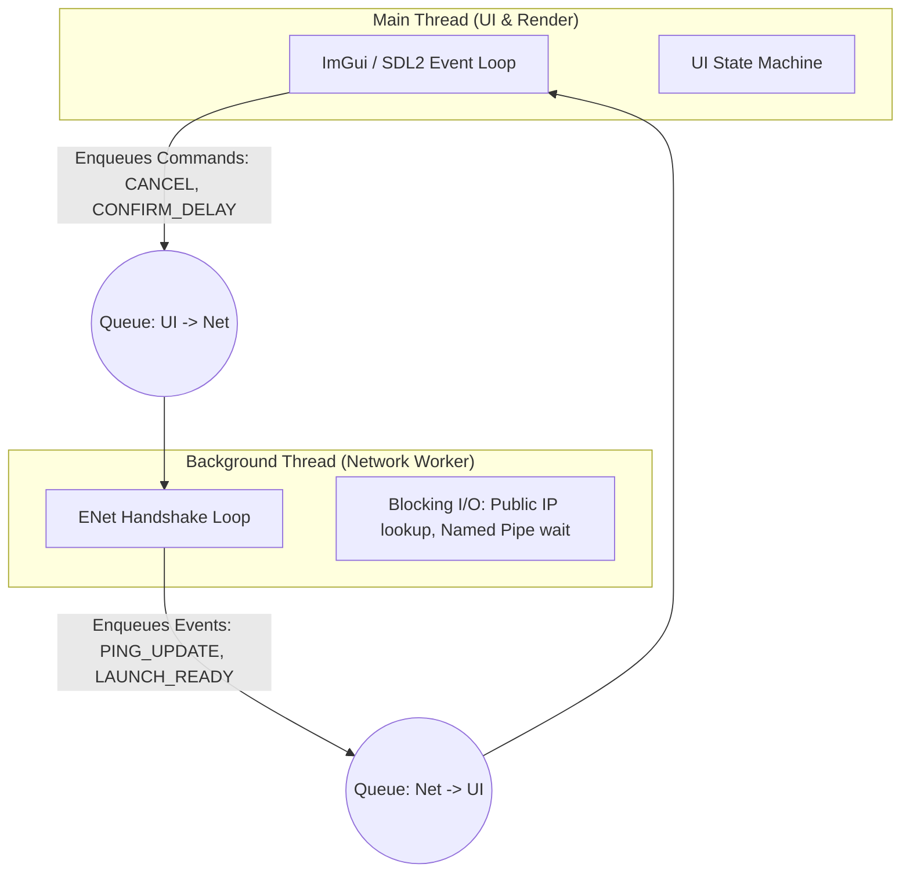

# Multi-Threaded Architecture Plan (Launcher)

This document provides a conceptual design and clear implementation instructions to introduce multithreading to the ZZCaster launcher (`zzcaster.exe`). The primary goal is to **decouple blocking network/file I/O operations from the main GUI rendering thread (SDL2/OpenGL/ImGui)**, ensuring a 100% responsive interface that remains unaffected by network conditions or VSync rates.

---

## 1. Architectural Overview

The proposed design splits the launcher into two threads with strictly separated memory boundaries:



### A. Main Thread (UI & Rendering)
* **Responsibilities:** Polls SDL events (keyboard/gamepad/mouse), renders the Dear ImGui interface at the monitor's VSync rate, and updates visual states.
* **Threading Rule:** **Never block.** Sinking actions (e.g. clicking "Host" or "Join") must only push a command message into the outgoing queue and return instantly.

### B. Background Thread (Network Worker)
* **Responsibilities:** Spawned when the user enters the netplay state (Host/Join). Performs sifting DNS queries, public IP lookups via wininet, ENet handshake protocols (version check, ping measurement), and synchronizes with the Windows Named Pipe.
* **Threading Rule:** Runs on a dedicated tick rate (e.g., 100Hz or every 10ms), entirely independent of the monitor's VSync frequency.

---

## 2. Synchronization & Communication (Message Passing)

To avoid race conditions and complex mutex locking across the entire UI state, communication is strictly handled via **Message Passing** using two thread-safe, lock-free or mutex-guarded concurrent queues:

1. **`UiCommand` Queue (UI $\rightarrow$ Network Thread):** Sends user commands to the worker.
2. **`NetplayEvent` Queue (Network Thread $\rightarrow$ UI):** Informs the UI of progress, IP resolutions, and handshake results.

---

## 3. Data Structures Blueprint (Zig 0.16)

Below are the suggested structures and tagged unions for representing commands, events, and a thread-safe message queue.

### Command and Event Definitions
```zig
const std = @import("std");

/// Commands sent from the UI (Main Thread) to the Network Worker thread.
pub const UiCommand = union(enum) {
    start_host: struct {
        port: u16,
        local_name: []const u8,
    },
    start_join: struct {
        host: []const u8,
        port: u16,
        local_name: []const u8,
    },
    confirm_match: struct {
        delay: u8,
    },
    cancel: void,
};

/// Events sent from the Network Worker thread back to the UI.
pub const NetplayEvent = union(enum) {
    status_changed: enum {
        resolving_ip,
        listening,
        connecting,
        handshaking,
        waiting_confirmation,
        launching,
        failed,
    },
    ip_resolved: struct {
        public_ip: []const u8,
        local_ip: []const u8,
    },
    peer_connected: struct {
        name: []const u8,
        connection_type: []const u8,
    },
    ping_update: struct {
        avg_ms: f64,
        min_ms: f64,
        max_ms: f64,
    },
    launch_ready: struct {
        delay: u8,
        rollback: u8,
        peer_port: u16,
        peer_addr: []const u8,
    },
    error_occurred: []const u8,
};
```

### Thread-Safe Queue Implementation
```zig
pub fn ThreadSafeQueue(comptime T: type) type {
    return struct {
        const Self = @this();
        const Node = struct {
            data: T,
            next: ?*Node = null,
        };

        mutex: std.Thread.Mutex = .{},
        cond: std.Thread.Condition = .{},
        head: ?*Node = null,
        tail: ?*Node = null,
        allocator: std.mem.Allocator,

        pub fn init(allocator: std.mem.Allocator) Self {
            return .{ .allocator = allocator };
        }

        pub fn deinit(self: *Self) void {
            self.mutex.lock();
            defer self.mutex.unlock();
            var curr = self.head;
            while (curr) |node| {
                const next = node.next;
                self.allocator.destroy(node);
                curr = next;
            }
            self.head = null;
            self.tail = null;
        }

        pub fn enqueue(self: *Self, data: T) !void {
            const node = try self.allocator.create(Node);
            node.* = .{ .data = data };

            self.mutex.lock();
            defer self.mutex.unlock();

            if (self.tail) |t| {
                t.next = node;
            } else {
                self.head = node;
            }
            self.tail = node;
            self.cond.signal();
        }

        /// Non-blocking pop. Returns null if the queue is empty.
        pub fn pop(self: *Self) ?T {
            self.mutex.lock();
            defer self.mutex.unlock();

            const node = self.head orelse return null;
            self.head = node.next;
            if (self.head == null) {
                self.tail = null;
            }
            const data = node.data;
            self.allocator.destroy(node);
            return data;
        }
    };
}
```

---

## 4. Step-by-Step Implementation Instructions

### Phase 1: Implement Communication Layer
1. Add the definitions of `UiCommand`, `NetplayEvent`, and `ThreadSafeQueue` to a new shared file `src/launcher/net_worker_types.zig`.
2. Ensure you write tests to validate the `ThreadSafeQueue` enqueuing and popping operations from multiple concurrently running threads.

### Phase 2: Refactor `NetplaySession` into a Worker Thread
1. Create a `src/launcher/net_worker.zig` containing a background thread entry point:
   ```zig
   pub fn runNetworkWorker(
       allocator: std.mem.Allocator,
       io: std.Io,
       log: *logging.Logger,
       cmd_queue: *ThreadSafeQueue(UiCommand),
       event_queue: *ThreadSafeQueue(NetplayEvent),
   ) void;
   ```
2. Inside `runNetworkWorker`, implement a loop that wakes up every 10ms.
3. Keep the inner network operations (like `getPublicIp` and ENet packet processing) synchronous/blocking relative to the worker thread. Since it is in a background thread, blocking for 5 seconds on DNS/IP lookup does not affect the UI thread.
4. Replace all direct UI state mutations in `NetplaySession` with `event_queue.enqueue(...)` calls.
5. Poll `cmd_queue.pop()` in the worker loop to handle commands like `confirm_match` or `cancel` immediately.

### Phase 3: Update the UI Loop (`ui.zig` & `ui_waiting_for_peer.zig`)
1. In `ui.zig`, initialize both command and event queues when entering the Waiting for Peer page.
2. Spawn the worker thread using:
   ```zig
   var thread = try std.Thread.spawn(.{}, runNetworkWorker, .{ allocator, io, log, &cmd_queue, &event_queue });
   ```
3. At the beginning of the frame update (inside `drawWaitingForPeer`), drain the `event_queue`:
   ```zig
   while (event_queue.pop()) |event| {
       // Mutate GUI states, error messages, and transitions based on the events.
   }
   ```
4. If a UI button is clicked (e.g. Cancel):
   * Send the command to the worker: `try cmd_queue.enqueue(.cancel);`
   * Join the thread: `thread.join();`
   * Cleanup the queues and transition back to `.idle`.

---

## 5. Potential Risks & Mitigation Strategies

| Risk | Cause | Mitigation |
| :--- | :--- | :--- |
| **Worker Thread Deadlock** | ENet or TCP sockets blocking indefinitely during poll. | Always pass a short timeout (e.g. `timeout_ms = 0` or `10`) to ENet service functions. |
| **Race Conditions on Shared Slices** | Strings like display name or peer addresses shared by pointer. | Always duplicate (`dupe`) or copy strings into fixed-size arrays within command/event payloads. |
| **Double Joining / Orphaned Threads** | Exiting GUI pages without cleaning up worker states. | Use a dedicated state variable or wrapper structure for managing the worker's thread handle lifecycle. |
